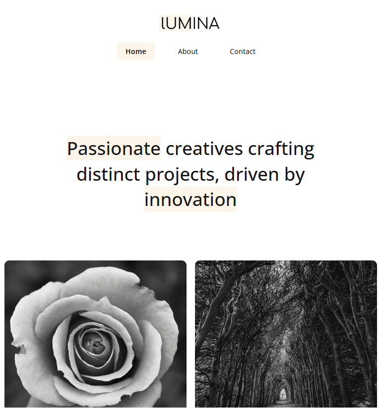
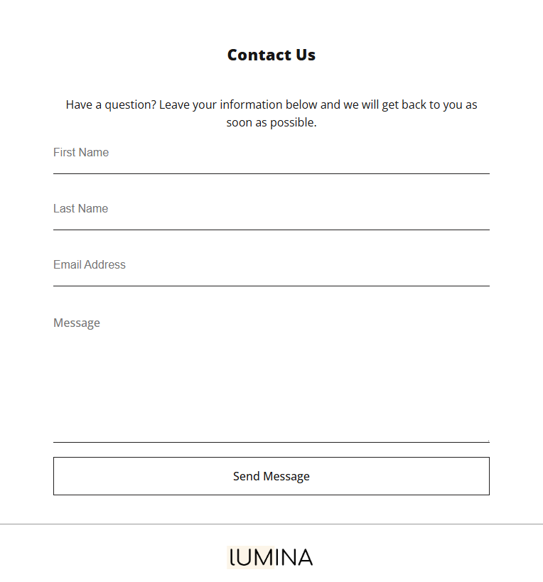

# 🌐Lumina Creative

A demo website showcasing pixel-perfect design mimification using vanilla technologies (HTML,CSS). The website is also responsive.

---

## 🔗Demo

<a href="https://mohamedemad2251-luminacreative.netlify.app/">

Check Out The Website!

</a>

---

## 🛠️Tech Stacks

---

## ✨Features

<ul>
  <li>Fully responsive layout.</li>
  <li>Semantic HTML structure.</li>
  <li>Lightbox-Effect Integration.</li>
  <li>Consistent design system across all pages.</li>
  <li>Netlify-powered contact form (serverless, no backend required).</li>
  <li>Modern typography (Google Fonts).</li>
  <li>Social media integration (Font Awesome icons, dummy links).</li>
</ul>

---

## 📷Preview

### Desktop

 &nbsp;

 &nbsp;

 &nbsp;

### Mobile

 &nbsp;

 &nbsp;

 &nbsp;

 &nbsp;

 &nbsp;

---
